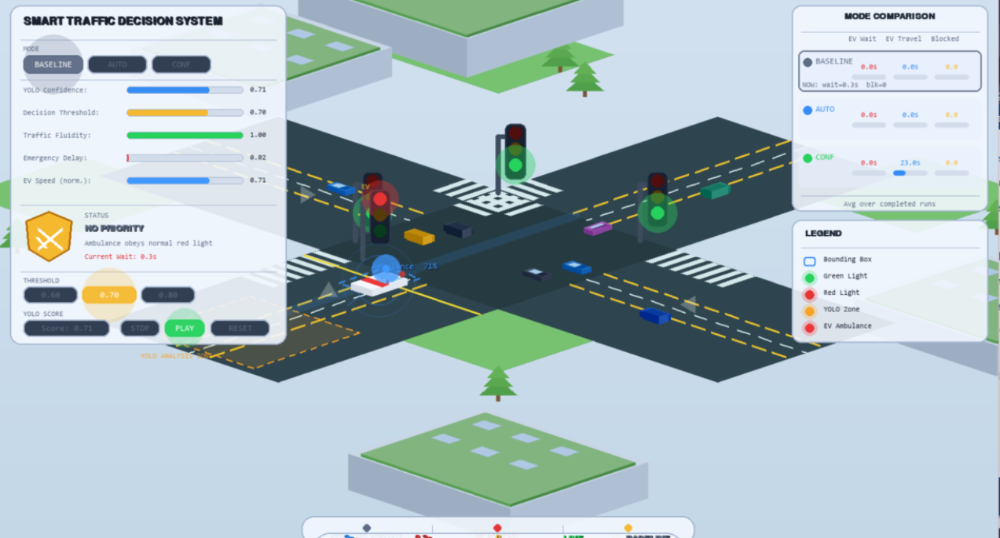

# 🚨 Optimization of Traffic Signal Preemption for Emergency Vehicles

**École Mohammadia d'Ingénieurs — PFA Report 2025–2026**  
**Department of Modeling and Scientific Computing (MIS)**

**Authors:** Sofia KHARBOUCHE & Hayat WALDI  
**Supervisors:** Pr. Rachid ELLAIA & M. Mohamed LAMRABET

---

## 📌 Overview

This project develops and evaluates an intelligent **traffic signal preemption system** for emergency vehicles (EVs), coupling two complementary components:

- A **deep learning perception module** based on YOLO (You Only Look Once)
- A **microscopic traffic simulation** environment built with SUMO

The system detects emergency vehicles from camera images and produces a continuous confidence score p̂ ∈ [0,1], which drives a conditional priority decision at signalized intersections. Kalman and EMA filters are further applied to stabilize the noisy score in realistic conditions.

---

## 🏗️ System Architecture

```
Camera → YOLO Detection → Confidence Score p̂ → Decision (p̂ ≥ θ ?) → SUMO/TraCI → KPI Evaluation
```

---

## 📁 Repository Structure

| File | Description |
|------|-------------|
| `Yolo_training.ipynb` | YOLO model training & validation notebook (Kaggle/GPU) |
| `sumo_project_final.zip` | Full SUMO simulation: Python scripts, XML network configs, CSVs, result figures |
| `output_YOLO_model.zip` | Trained YOLO model weights and output metrics |
| `PFA_report.pdf` | Full project report (46 pages) |
| `Presentation_PFA.pdf` | Project presentation slides |

### Inside `sumo_project_final.zip`

| Script | Role |
|--------|------|
| `run_scenarios_partieA.py` | SUMO simulation of Baseline, Auto and Confidence modes |
| `generate_figures_partieA.py` | Generates KPI comparison figures from Part A |
| `run_scenarios_kalman_ema.py` | Compares raw Confidence, Kalman-filtered and EMA-smoothed decisions |
| `visual_simulation.py` | Pygame pedagogical visualization of the three preemption strategies |

---

## 🔍 Part A — YOLO Detection Module

- **Dataset:** 1,547 images, 3 classes (Ambulance, Fire Truck, Police Car), sourced from Roboflow Universe
- **Model:** YOLOv26m (Ultralytics), fine-tuned on GPU (NVIDIA Tesla T4, Kaggle)
- **Training:** 50 epochs, image size 640×640, mixed precision (AMP)

### Results

| Metric | Value |
|--------|-------|
| mAP@50 | **89.6%** |
| mAP@50–95 | 63.4% |
| Precision | **100%** |
| Recall | **94.0%** |
| F1 (max) | 87.0% |
| Mean confidence p̂ | 0.71 |

---

## 🚦 Part A — SUMO Traffic Simulation

Three preemption strategies evaluated across **45 simulation runs** (3 traffic densities × 3 seeds):

| Mode | Trigger | Role |
|------|---------|------|
| **Baseline** | None | Reference (no priority) |
| **Auto** | EV present | Ideal upper bound |
| **Confidence** | p̂ ≥ θ | Realistic AI-based mode |

### Key Results

- **39–40% reduction** in EV travel time with minimal civil traffic disruption
- Thresholds θ ∈ {0.60, 0.70} activated priority (p̂ = 0.71 exceeds both)
- Threshold θ = 0.80 too strict → behaves like Baseline

---

## 📡 Part B — Kalman & EMA Filtering

To handle real-world detection noise (occlusions, motion blur, false negatives), two smoothing filters were applied to the YOLO score before the preemption decision:

- **1D Kalman Filter** — recursive estimator, robust to false-negative frames
- **Exponential Moving Average (EMA)** — classical smoothing, α = 0.3

### Stability Results (θ = 0.65)

| Metric | Raw | EMA | Kalman |
|--------|-----|-----|--------|
| Score std deviation | 0.3578 | 0.0437 | **0.0363** |
| Priority activation | 43.7% | 87.4% | **93.2%** |
| ON/OFF state changes | 46 | 6 | **6** |

**Kalman outperforms EMA** by maintaining a stable estimate during false-negative frames, achieving 93.2% priority activation vs. 43.7% for the raw score.

---

## 🛠️ Technologies

| Component | Tools |
|-----------|-------|
| Object Detection | Python, PyTorch, Ultralytics YOLOv26m |
| Traffic Simulation | SUMO 1.26.0, TraCI |
| Filtering | NumPy (Kalman 1D, EMA) |
| Visualization | Pygame 2.6.1 |
| Training Platform | Kaggle Notebooks (NVIDIA Tesla T4) |
| Report | LaTeX |

---

## 📊 Main Findings

1. A YOLO confidence score can effectively drive uncertainty-aware traffic signal preemption
2. Confidence-based priority (θ ≤ 0.70) achieves **performance comparable to ideal Auto mode**
3. The Kalman filter is the preferred smoothing method: lowest score variance, highest priority activation rate
4. EV travel time is reduced by ~40% with negligible impact on civil traffic

---

## 🎮 Pygame Visualization

A Pygame interface was built as a pedagogical visualization layer, displaying in real time: the active mode (Baseline / Auto / Confidence), the YOLO confidence score, the decision threshold, traffic fluidity, and whether the priority decision is accepted or rejected.



---

## 🔭 Future Perspectives

- Real-time YOLO–SUMO coupling via a live inference server
- Adaptive threshold based on traffic density
- Reinforcement learning for dynamic control policy
- Multi-EV coordination
- V2X (vehicle-to-infrastructure) communication integration
